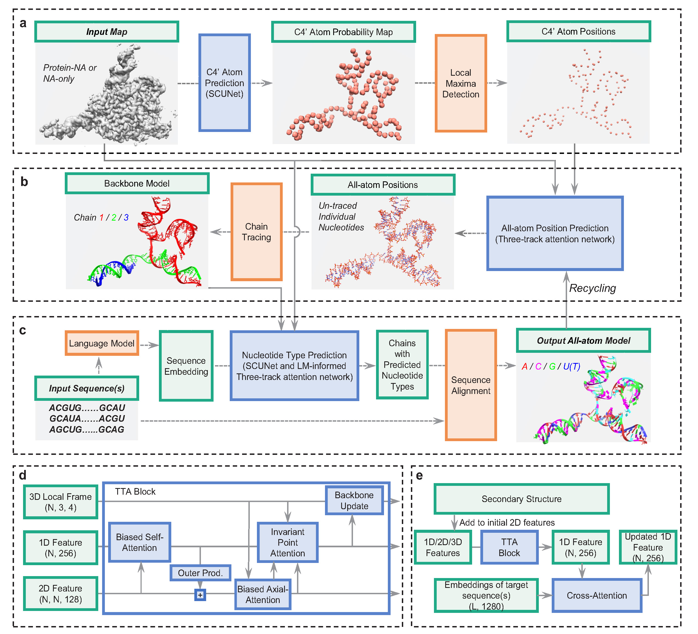
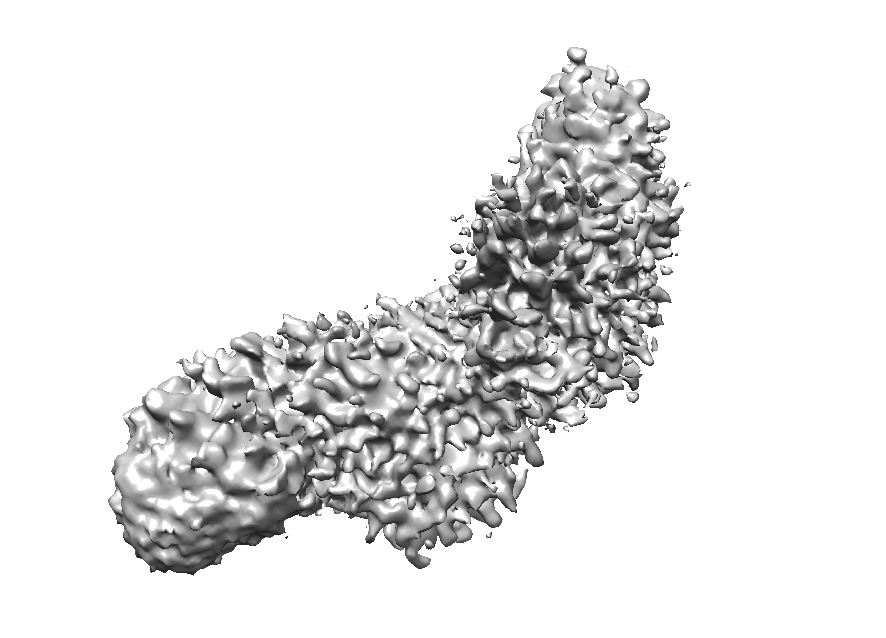
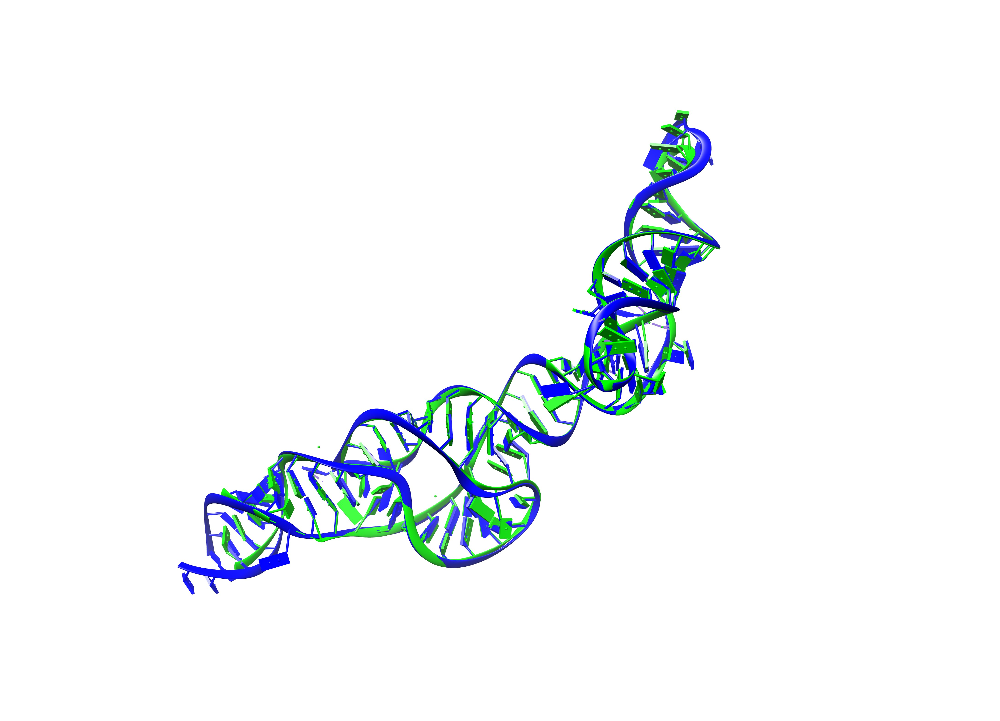

# EMNAFold

## Overview
EMNAFold is a software for automatic nucleic acid modeling from cryo-EM density maps. 



## Requirements
**Platform**: Linux (Mainly tested on CentOS 7).

**GPU**: A GPU with >12 GB memory is required, advanced GPU like A100 is recommended.

**CUDA**: >= 11.8

## Installation
#### 0. Install conda

We use conda to manage the required packages, if it is not installed, please refer to https://docs.anaconda.net.cn/miniconda/install/ for installation.

#### 1. Download EMNAFold

Download EMNAFold via github
```
git clone https://github.com/huang-laboratory/EMNAFold.git
cd EMNAFold
# if you do not have git, download the compressed file
# wget https://github.com/huang-laboratory/EMNAFold/archive/refs/heads/main.zip
# unzip main.zip
# cd EMNAFold-main
```

#### 2. Install EMNAFold

We write the tedious bash commands into one install.sh, so install EMNAFold is just one command
```
# replace /path/to/your/conda to the actual conda directory, e.g. /home/someone/miniconda3
bash install.sh /path/to/your/conda
```
Alternatively, if you are familiar with Linux, you can run the commands separately in install.sh. 

## Usage
Running EMNAFold is very straight forward with one command like
```
# dont forget to activate the conda env first
# conda activate emnafold
emnafold build --map MAP.mrc \
    --dna DNA_SEQ.fa \ # DNA seqs
    --rna RNA_SEQ.fa \ # RNA seqs
    --output OUT \
    --device GPUID # default is 0 (a.k.a cuda:0)
```
- Cryo-EM density map and output directory is **required**.
- Input fasta file could include multiple (>= 1) sequences.
- If you launch > 1 modeling jobs, the output directory **MUST** be set differently.

The output model (named **output.cif**) will be saved in the specified output directory. Besides the final model.

**Check the command usage any time you forget how to run EMNAFold**
```
emnafold build --help
```
The following shows running on an example.

#### 1. Modeling with target sequence(s)
We provide an example for users, download it from our website
```
wget http://huanglab.phys.hust.edu.cn/EMNAFold/examples/8T5O.tgz
tar -zxvf 8T5O.tgz
cd 8T5O
```
Then run EMNAFold
```
emnafold build --map 8T5O.mrc --rna 8T5O.fa --device 0 --output out
```

<!--
The input map looks like

The output model (blue) and the PDB model (green) looks like

!-->

<table align="center">
    <tr>
        <td align="center">
            <p>The input map looks like</p>
            
        </td>
        <td align="center">
            <p>The output model (blue) and the PDB model (green) looks like</p>
            
        </td>
    </tr>
</table>

#### Post refinement
Although EMNAFold already shows a high backbone and side-chain match to the density map, it is recommended to use third-party programs to further refine the model-map fit and model geometries, e.g. using **phenix.real_space_refine**
```
phenix.real_space_refine 8T5O.mrc out/output.cif resolution=2.9
```
This will typically take several minutes.

## Trouble shooting
- **No module named "xxx"**: This means package "xxx" is not successfully installed in your EMNAFold conda environment, use `pip install xxx` or `conda install xxx` to install the missing packages.

- **xxx: command not found...**: This means you are not in the EMNAFold env, try to activate it first. 

- **LLVMPY_AddSymbol, version `GLIBCXX_3.4.29`, `CXXABI`, ... , not found, OSError: Could not find/load shared object file**: Too old CXX library version or CXX dynamic library is not found by EMNAFold (this happens for some old operating systems), use `export LD_LIBRARY_PATH=$CONDA_PREFIX/lib/:$LD_LIBRARY_PATH` (when you are in EMNAFold env) to include the libstdc++.so The `$CONDA_PREFIX` is actually where your conda env path is, you can check it by `$ echo $CONDA_PREFIX`. An example path could be `/home/user/conda/envs/EMNAFold`.

- **AssertionError: Egg-link /xxx/xxx.egg-link (to /xxx) does not match installed location of xxx (at /xxx)**: This means you fail to install the program. Solution: remove the conda env, install the program again.

- **Error at getp/CSSRX, segmentation fault**:
Your operating system is not compatible with our pre-compiled executables, please re-compile the programs and use the new ones (this requires g++ >= 4.8.5). Using `bash compile.sh`, we will auto-detect the g++ version, compile programs and copy to `bin/`. 


## Citation
Tao Li, et al. Highly accurate nucleic acid model building from cryo-EM maps with EMNAFold. *In submission*. 2025
```
@article {EMNAFold2025,
    title = {Highly accurate nucleic acid model building from cryo-EM maps with EMNAFold},
    author = {Tao Li, Sheng-You Huang},
    journal = {In submission},
    year = {2025},
    doi = {}
}
```

